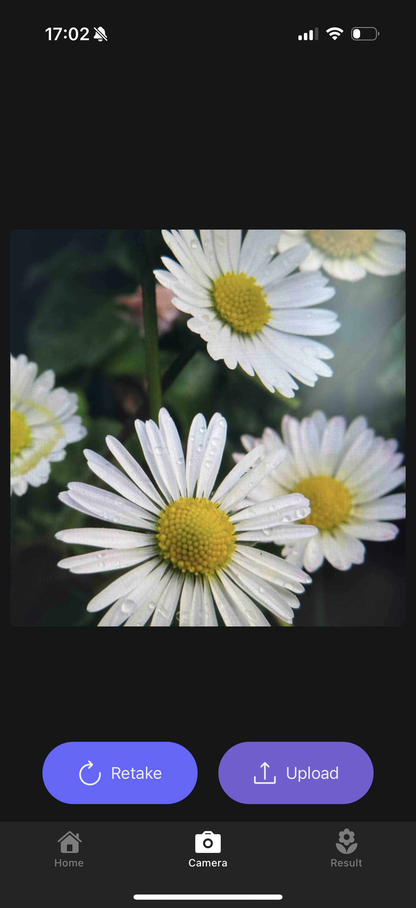

# Welcome to BloomIQ 🌼

BloomIQ is a mobile app designed to help users identify common UK flowers by simply taking or uploading a photo. This project is built using **React Native** and **Expo**, ensuring a smooth and efficient user experience.

---

## 📱**Project Overview**
### **Goal of the App**
BloomIQ helps users identify flowers by analyzing photos. The app is powered by a fine-tuned **MobileNetV2 CNN model**, which processes the image and provides a list of possible matches with accuracy percentages.

**Why MobileNetV2?**
- ✅ Lightweight and optimized for mobile devices
- ✅ Fast inference with **low latency**
- ✅ Efficient for real-time flower classification

## **App Structure & Screens**
<p>
  
  
  
    
  
  
</p>

### **1. Home Screen (`index.tsx`)**
- Displays a **welcome message**.
- Encourages users to **take or upload a flower photo**.
- Includes two buttons: **Capture** and **Upload**.
    - **Capture**: Takes the user to the **Camera screen**, where they can take a photo.
    - **Upload**: Opens the **photo library**, allowing the user to select an image, zoom in/out, and crop it to a **1:1 ratio**.

⚠️ **Permissions:**
- The first time a user taps Capture, they will be asked for camera access permission.
- The first time a user taps Upload, they will be asked for photo library access permission.

### **2. Camera Screen (`camera.tsx`)**
- Uses **Expo Camera** to capture an image.
- Once a photo is taken, it shows a **preview**.
- Users can **Retake** or **Upload** the image for identification.

### **3. Result Screen (`result.tsx`)**
- Displays **identification results**.
- Shows the **top 3 best matches** with:
  - **Flower name**
  - **Confidence percentage**
  - **A small image preview**
- Allows users to **start over** and takes them to Home screen.

---

## **📥 How to Run the App Locally**  
> ⚠ **Note:** All commands should be executed in **CMD (Command Prompt) or Bash**, not PowerShell. Running them in PowerShell may cause issues with permissions or dependencies.

### **1. Prerequisites**  
Before running the app, make sure you have:  
- ✅ **Node.js** installed ([Download](https://nodejs.org/))  
- ✅ **Git** installed ([Download](https://git-scm.com/))  

### **2. Clone the Repository**  
```bash
git clone https://github.com/your-repo-name/bloom-iq.git
cd bloom-iq/frontend
```

### **3. Check Node.js and Install Latest npm (if needed)**
Verify the Node.js version:
```bash
node -v
```
If npm is not installed or outdated, update it:
```bash
npm install -g npm@latest
```
### **4. Install Dependencies**
Ensure you're inside the **frontend** directory and run:
```bash
npm install --legacy-peer-deps
```
### **5. Install Expo CLI**
```bash
npm install -g expo-cli --legacy-peer-deps
```

### **6. Set Up Expo Go**  
You need to install the app on your smartphone first.
- 📥 **Download Expo Go** → ([Android](https://play.google.com/store/apps/details?id=host.exp.exponent) | [iOS](https://apps.apple.com/us/app/expo-go/id982107779))  
- 📝 **Create an Expo account** if you don’t have one.  
- 🔑 **Log in via the terminal:**  
```bash
  npx expo login
```
Use your Expo Go credentials (nickname & password).

### **7. Start the App**
Run the following command:
```bash
npx expo start
```
⚠️ **Important:**
Ensure you are in Expo Go build mode, or the QR code won’t work.
- Check your terminal output to see the current build.
- If needed, press 's' in the terminal to switch to Expo Go (see screenshot below).
<br>

<p><br></p>

### **8. Connect to Expo Go**  

1. 📸 **Scan the QR code** shown in your terminal using the **Expo Go** app on your phone.  
2. 🛠️ A new window will open asking for your **preferred build** → **Choose "Expo Go"**.  
3. 🌱 You should now see **"BloomIQ"** in Expo Go. **Tap it to launch the project.**  
4. Once the app is connected, you can use the **development build** in the future if preferred.

---

## **Development Context**
This prototype has been developed as part of my **MSc thesis** at the **University of Bath**. The goal is to explore real-time **flower identification using deep learning models** and build a functional user interface for non-technical users.  

To ensure fast and efficient on-device inference, the app utilizes a **lightweight CNN model (MobileNetV2)**, which is optimized for mobile performance while maintaining high accuracy.

---

## **Future Improvements**
- ✅ **Enhance the AI model with additional flower species**.
- ✅ **Improve UI/UX with animations and better styling**.
- ✅ **Store user history for past identifications**.

---

## 📌 **Notes**
- If you face issues with Expo Go, make sure you are logged in and connected to the correct build.
- If the app crashes after uploading a photo, ensure you’re using a **valid JPEG or PNG image**.
- For **advanced debugging**, use expo doctor to check for dependency conflicts.
