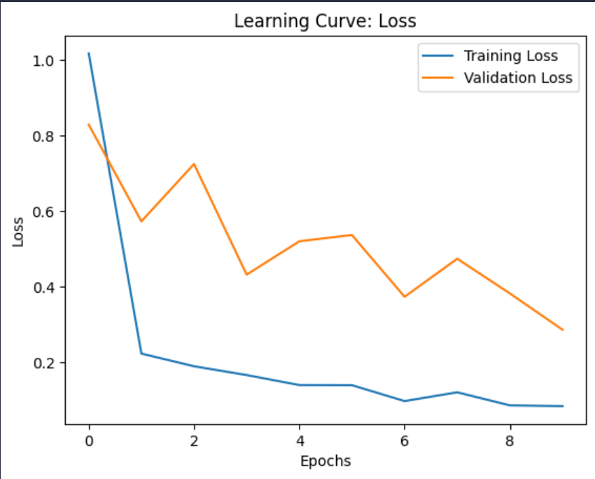
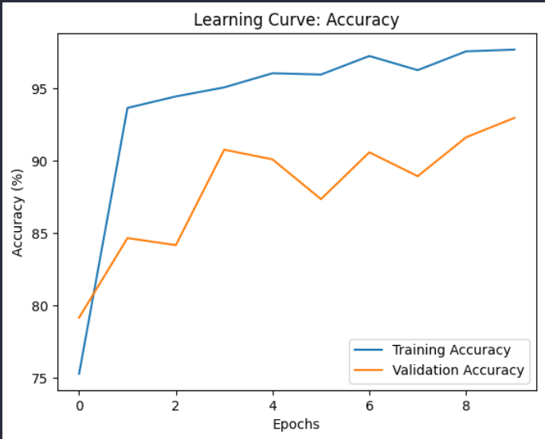

## Results

- **Model Accuracy:**
  - Training Accuracy: 97.70%
  - Validation Accuracy: 92.98%%
- **Loss:**
  - Final Training Loss: 0.0836
  - Final Validation Loss: 0.2860
- Training stabilized after 10 epochs with minimal overfitting.

---

## Notes

- The MobileNetV3 model showed promising results for flower recognition.
- Future iterations may include:
  - Experimenting with different learning rates and optimizers.
  - Increasing the number of epochs.
  - Exploring other data augmentation techniques.
