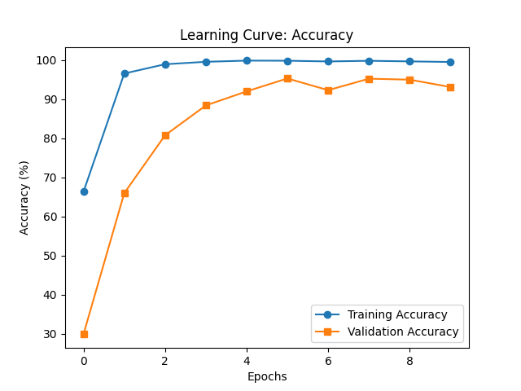

# **Model Training Summary**

## **Training Performance**
| Epoch | Train Loss | Train Accuracy | Val Loss | Val Accuracy |
|-------|------------|---------------|----------|--------------|
| 1     | 1.5461     | 66.34%        | 3.6893   | 29.91%       |
| 2     | 0.1258     | 96.57%        | 1.6793   | 66.00%       |
| 3     | 0.0428     | 98.93%        | 0.8085   | 80.77%       |
| 4     | 0.0155     | 99.56%        | 0.4608   | 88.40%       |
| 5     | 0.0070     | 99.86%        | 0.3212   | 92.00%       |
| 6     | 0.0069     | 99.83%        | 0.1840   | 95.30%       |
| 7     | 0.0123     | 99.65%        | 0.3267   | 92.31%       |
| 8     | 0.0099     | 99.82%        | 0.2077   | 95.24%       |
| 9     | 0.0137     | 99.66%        | 0.2155   | 94.99%       |
| 10    | 0.0134     | 99.51%        | 0.3145   | 93.10%       |

## **Key Observations**
- **Overfitting:** Training accuracy reached **99.86%**, while validation accuracy peaked at **95.30%**, suggesting some overfitting.
- **Loss Improvement:** Validation loss started at **3.6893** and significantly dropped to **0.1840**, showing good convergence.
- **Slight Performance Drop:** In the last few epochs, validation accuracy fluctuated slightly, which could indicate minor overfitting or dataset variability.

## **Suggested Improvements**
1. **Regularization:** Introduction L2 regularization (weight decay) or dropout to mitigate overfitting.
2. **Early Stopping:** Setting an early stopping criterion to prevent unnecessary training when validation accuracy stops improving.
3. **Data Augmentation:** If the dataset is small, applying augmentation techniques (e.g., rotation, flipping, color jittering) could improve generalization.
4. **Hyperparameter Tuning:** Adjusting:
   - Learning rate scheduling (e.g., ReduceLROnPlateau)
   - Batch size optimization
   - Optimizer choice (AdamW, RMSprop, etc.)
5. **Ensemble Models:** If performance gains are needed, combining multiple models or architectures is considered.

