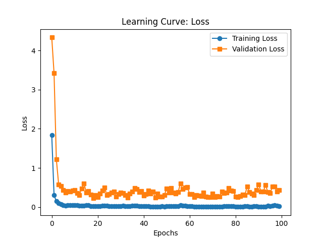

# **Model Training Summary**

Training has been performed on RunPod instance at https://www.runpod.io/.

## **Best Training Metrics**

| Metric                   | Value   |   Epoch |
|:-------------------------|:--------|--------:|
| Best Training Accuracy   | 99.80%  |      72 |
| Best Validation Accuracy | 94.69%  |      72 |
| Best Training Loss       | 0.0066  |      72 |
| Best Validation Loss     | 0.2271  |      19 |

## **Key Observations**

- **Overfitting:** Training accuracy reached **99.80%**, while validation accuracy peaked at **94.69%**, suggesting some overfitting.
- **Loss Improvement:** Validation loss started at a higher value but significantly dropped to **0.2271**, showing good convergence.
- **Slight Performance Drop:** Best validation accuracy occurred at epoch **72**, indicating potential early stopping opportunities.

## **Suggested Improvements**

1. **Regularization:** Introduce L2 regularization (weight decay) or dropout to mitigate overfitting.
2. **Early Stopping:** Set an early stopping criterion to prevent unnecessary training when validation accuracy stops improving.
3. **Data Augmentation:** If the dataset is small, apply augmentation techniques (e.g., rotation, flipping, color jittering) to improve generalization.
4. **Hyperparameter Tuning:** Adjust:
   - Learning rate scheduling (e.g., ReduceLROnPlateau)
   - Batch size optimization
   - Optimizer choice (AdamW, RMSprop, etc.)
5. **Ensemble Models:** If performance gains are needed, consider combining multiple models or architectures.

