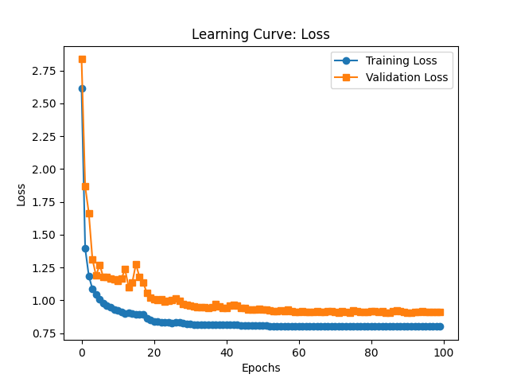
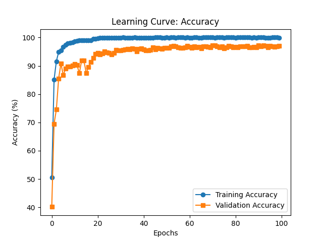

# **Model Training Summary**

- Training has been performed on RunPod instance at https://www.runpod.io/.
- Changed crossed entropy loss (CEL) to CEL with label_smoothing at 0.1
- Changed  LR scheduler from Adam to `ReduceLROnPlateau(optimizer, mode='min', factor=0.5, patience=3)`

## **Best Training Metrics**

| Metric                   | Value  | Epoch |
|:-------------------------|:-------|------:|
| Best Training Accuracy   | 100%   |    60 |
| Best Validation Accuracy | 97.07% |    60 |
| Best Training Loss       | 0.8035 |    58 |
| Best Validation Loss     | 0.2197 |    75 |

## **Key Observations**

- **Overfitting:** Training accuracy reached **100%**, while validation accuracy peaked at **97.07%**, suggesting some overfitting.
- **Loss Increase:** Validation loss started at a higher value but significantly increased to **0.9157**, showing worse convergence.
- **Slight Performance Increase:** Best validation accuracy occurred at epoch **60**, indicating potential early stopping opportunities.

## **Suggested Improvements**

1. **Regularization:** Introduce L2 regularization (weight decay) or dropout to mitigate overfitting.
2. **Early Stopping:** Set an early stopping criterion to prevent unnecessary training when validation accuracy stops improving.

