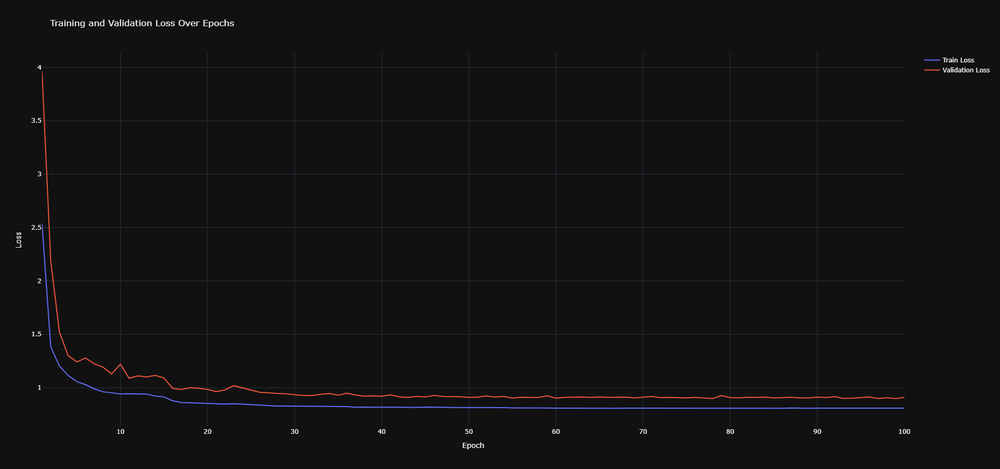
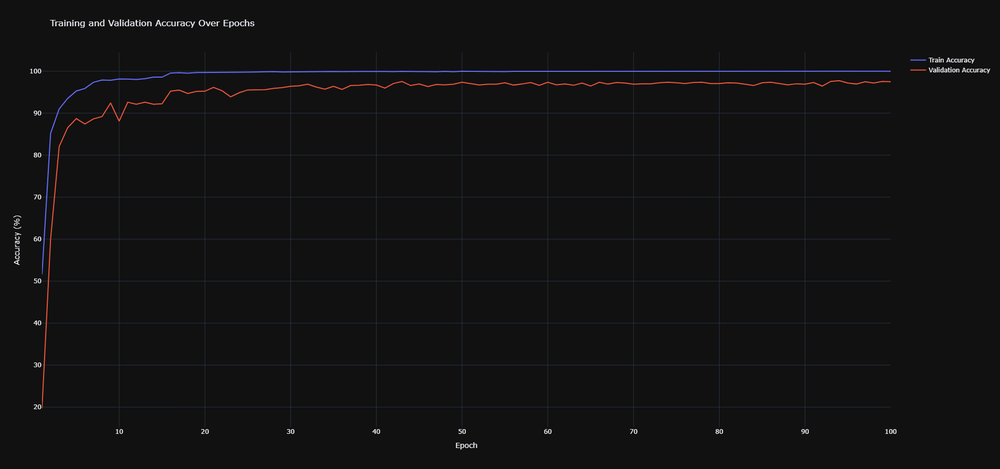

# **Model Training Summary**

- Training has been performed on RunPod instance at https://www.runpod.io/.
- Final training based on observation from ITR06

## **Best Training Metrics**

| Metric                   | Value | Epoch |
|:-------------------------|:------|------:|
| Best Training Accuracy   | 100%  |    53 |
| Best Validation Accuracy | 97.5% |    53 |

## **Key Observations**

- **Overfitting:** Training accuracy reached **100%**, while validation accuracy peaked at **97.07%**, suggesting some overfitting.
- **Loss Stable:**  **0.9157** -- the same convergence.
- **Slight Performance Increase:** Best validation accuracy occurred at epoch **60**, indicating potential early stopping opportunities.

## **Suggested Improvements**

1. **Regularization:** Introduce L2 regularization (weight decay) or dropout to mitigate overfitting.
2. **Early Stopping:** Set an early stopping criterion to prevent unnecessary training when validation accuracy stops improving.

