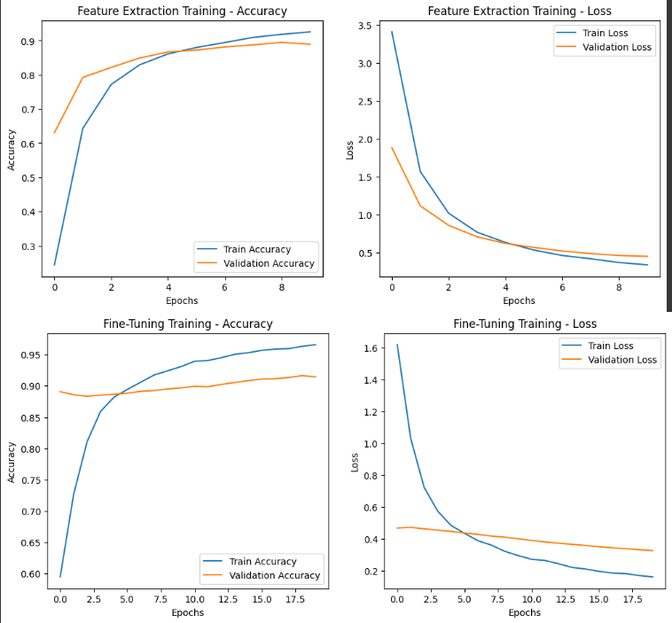

# **Model Training Summary**

- Training has been performed on Colab.
- L4 GPU
- Categorical Crossentropy
- `optimizers.Adam(learning_rate=0.001)` for **feature extraction**
- `optimizers.Adam(learning_rate=0.00001)` for **fine-tunning** 

## **Key Observations**

- **Accuracy:** Training accuracy reached **96%**, while validation accuracy peaked at **91%**, suggesting some overfitting.
- **Loss: The loss is around 0.1 for training and 0.3 for validation which it too high.**  
- **Performance:** Decent performance as for the first training. Model is able to identify most of folwers with good quality but struggle with low quality photos

## **Suggested Improvements**

1. **Augmentation:** Augmentation was basic (flip, brightness, saturation, hue) which does not challenge model quality-wise
2. **Early Stopping:** Introduction early stopping after increasing num of epochs.

