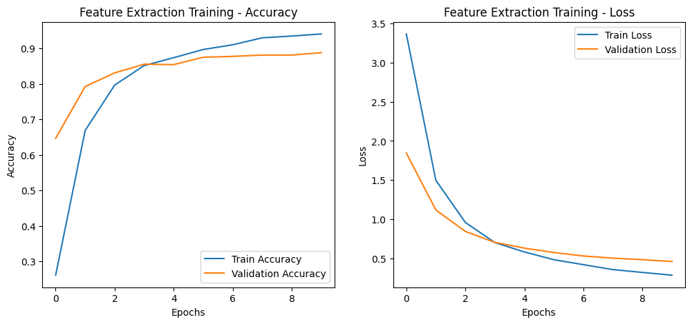
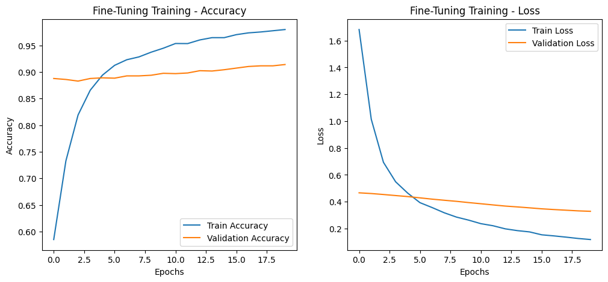

# **Model Training Summary**

- Training has been performed on Colab.
- L4 GPU
- Categorical Crossentropy
- `optimizers.Adam(learning_rate=0.001)` for **feature extraction**
- `optimizers.Adam(learning_rate=0.00001)` for **fine-tunning** 
- _**THIS WAS EXPERIMENTAL RUN WITHOUT DATA AUGMENTATION TO SEE A DIFFERENCE**_

## **Key Observations**

- **Accuracy:** Training accuracy reached **96%**, while validation accuracy peaked at **91%**, suggesting some overfitting.
- **Loss: The loss is around 0.1 for training and 0.3 for validation which it too high.**  
- **Performance:** No difference between augmented data and dry run

## **Suggested Improvements**

1. **Augmentation:** No augmentation this time. Introduction more complex image processing to diversify dataset
2. **Learning Rate Scheduler:** Introduction learning rate scheduler to lower learning rate over time.

