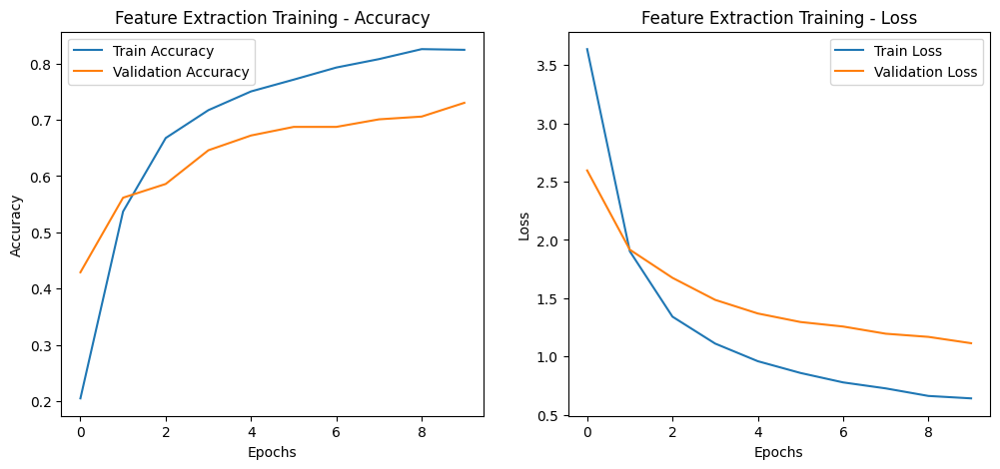
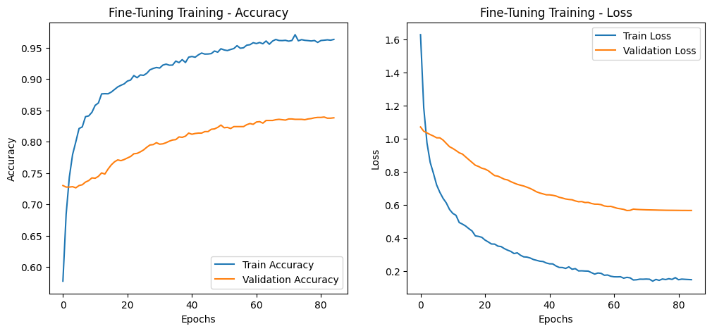

# **Model Training Summary**

- Training has been performed on Colab.
- L4 GPU
- Categorical Crossentropy
- `optimizers.Adam(learning_rate=0.001)` for **feature extraction**
- `optimizers.Adam(learning_rate=0.00001)` for **fine-tunning** 
- Decrease in performance due to the increased use of augmentation techniques.
- Intoduced Learning rate scheduler and Early Stopping

## **Key Observations**

- **Accuracy:** Training accuracy reached **96%**, while validation accuracy peaked at **83%**, Overfitting.
- **Loss: The loss is around 0.14 for training and 0.56 for validation which it too high.**  
- **Performance:** An increase in augmentation techniques led to reduced model accuracy, but it provided a solid foundation for future improvements.

## **Suggested Improvements**
- **L2 Regularization:**  Add kernel_regularizer=tf.keras.regularizers.l2(0.001) that introduces a penalties for weights
- **Early Stopping:** Decrease patience to prevent overfitting 

2. **:** 

