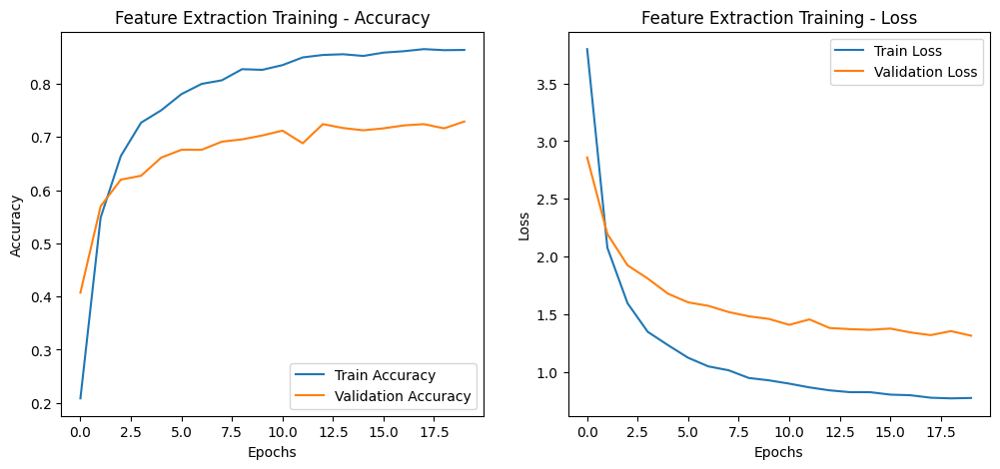
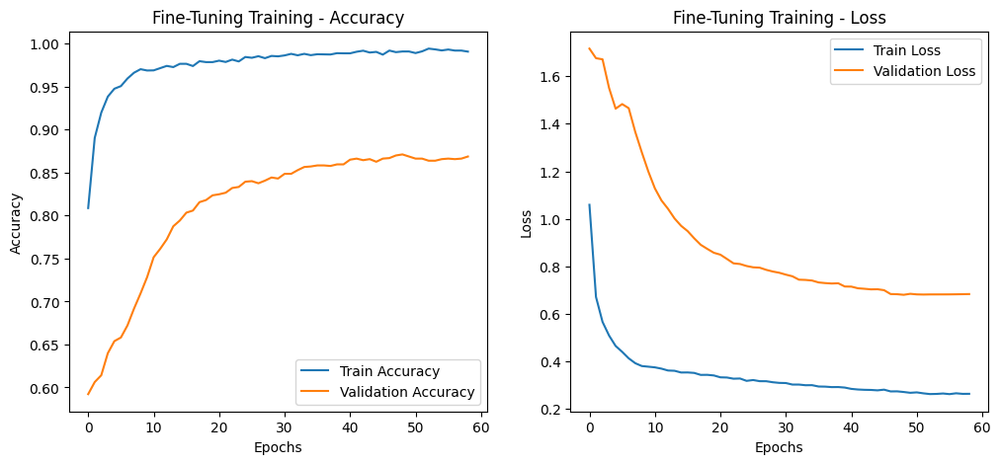

# **Model Training Summary**

- Training has been performed on Colab.
- L4 GPU
- Categorical Crossentropy
- `optimizers.Adam(learning_rate=0.001)` for **feature extraction**
- `optimizers.Adam(learning_rate=0.00001)` for **fine-tunning** 
- ` kernel_regularizer=tf.keras.regularizers.l2(0.001)` for weights penalties
- Increased num of epochs (10 -> 20) for feature extraction phase
- Increased learning rate for fine-tunning phase from 0.00001 to 0.0001 

## **Key Observations**

- **Accuracy:** Training accuracy reached **98%**, while validation accuracy peaked at **86%**, less overfitting.
- **Loss: The loss is around 0.2 for training and 0.6 for validation which it too high.**  
- **Performance:** An increase of epoch number in FT phase slightly improved validation accuracy

## **Suggested Improvements**
- **Parameter fine-tunning:** Experiment with learning rates and epoch as well as feature extraction phase  

## **Metrics:** 

