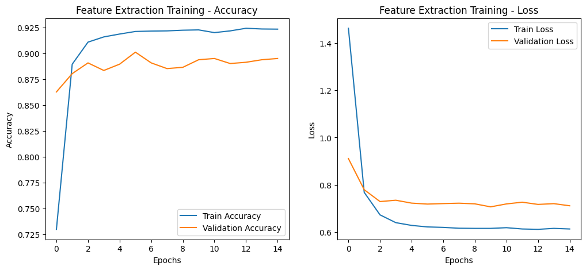
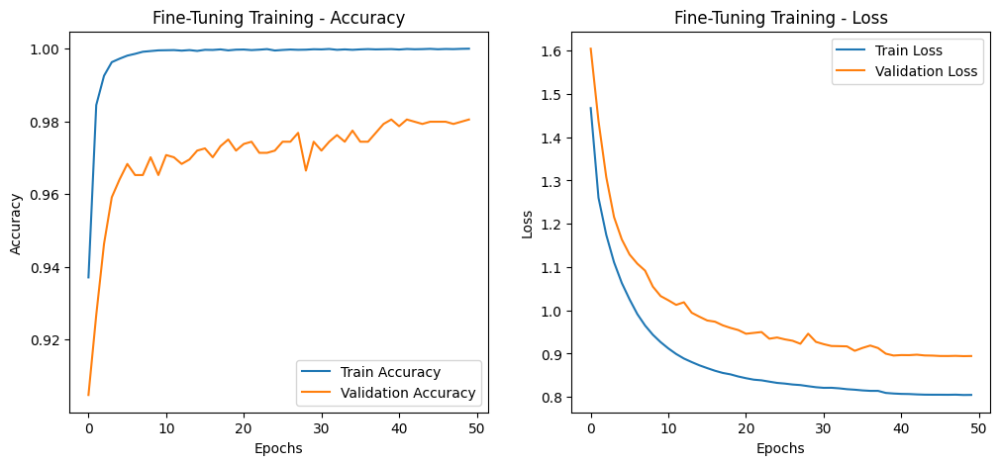

# **Model Training Summary**

- Training has been performed on Colab.
- L4 GPU
- Categorical Crossentropy
- `optimizers.Adam(learning_rate=0.001)` for **feature extraction**
- `optimizers.Adam(learning_rate=0.00001)` for **fine-tunning** 
- ` kernel_regularizer=tf.keras.regularizers.l2(0.001)` for weights penalties

**New Augmentations Approach** :
- Each time an image is flagged for augmentation, it undergoes six different transformations (random flip, brightness, contrast, saturation, hue, and random rotation). All of these transformations are combined into a single augmentation pipeline.
- Each transformation is applied with randomly selected parameters (e.g., brightness shift amount, rotation angle), resulting in different augmented outcomes every time—even for the same original image.
- For each original training image, the code creates one copy labeled as original (no augmentation) plus a configurable number of augmented copies. With the default setting (num_augmentations=3), each image is replicated four times total (1 original + 3 augmented).
- The replicate_for_training(...) function stores the paths and labels for both original and augmented copies in parallel arrays, allowing the actual augmentation to happen on-the-fly within the data pipeline (i.e., in load_image_conditional(...)).
- Because these random augmentations occur when each image is loaded, the final appearance of the augmented copies can vary from epoch to epoch.
- The specific transformations (flip, brightness, contrast, saturation, hue, rotation) and the number of augmented copies (num_augmentations) can be adjusted to match the desired diversity of training samples.
- 1 original + 3 augmentation pipelines
- 8189 * 4 =  32756
## **Key Observations**

- **Accuracy:** Training accuracy reached **99%**, while validation accuracy peaked at **98%**, very good accuracy.
- **Loss: The loss is around 0.8 for training and 0.8 for validation which it too high.**  
- **Performance:** Epochs number at 50

## **Suggested Improvements**
- **Parameter fine-tunning:** Apply more penalties to make model more confident (reduce loss numbers)

## **Metrics:** 

