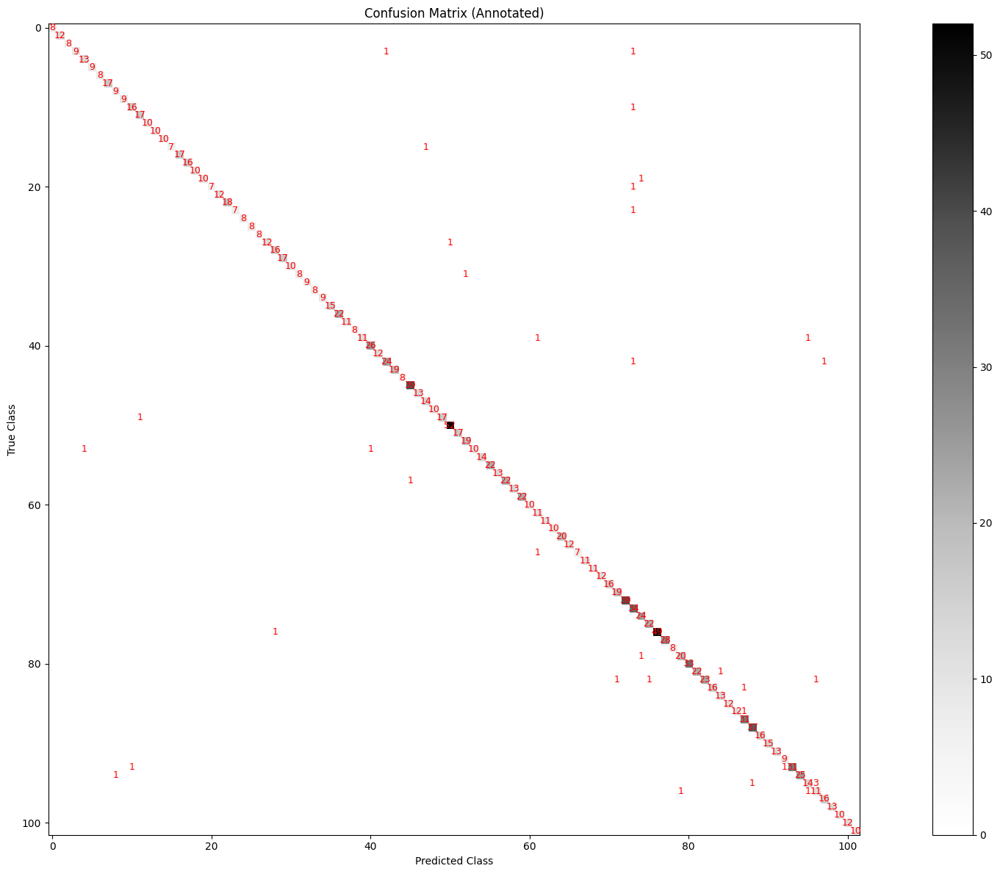

# **Model Training Summary**

- Training has been performed on Colab.
- L4 GPU
- Categorical Crossentropy
- `optimizers.Adam(learning_rate=0.001)` for **feature extraction**
- `optimizers.Adam(learning_rate=0.00001)` for **fine-tunning** 
- ` kernel_regularizer=tf.keras.regularizers.l2(0.001)` for weights penalties

**New Metrics** :
- Recall
- F1 Score
- K-5 Categorical
- 
## **Key Observations**

- **Accuracy:** Training accuracy reached **100%**, while validation accuracy peaked at **98%**, very good accuracy.
- **Loss: The loss is around 0.8 for training and 0.8 for validation which it too high.**  
- **Performance:** Epochs number at 50

## **Metrics:** 

